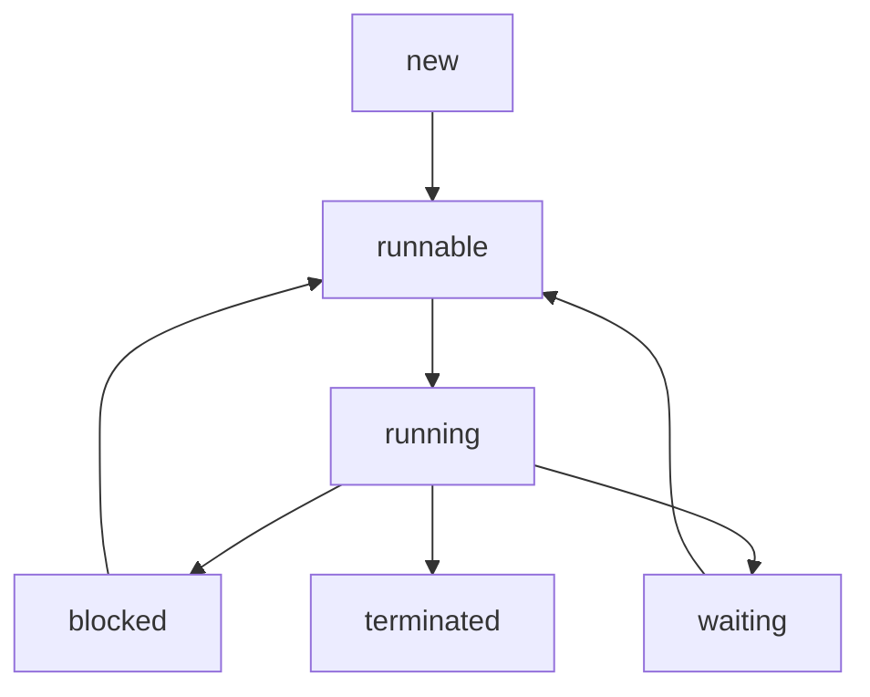

# Multithreading in Java 17

## Thread

In computer science, a thread of execution is the smallest sequence of programmed instructions that can be managed independently by a scheduler, which is typically a part of the operating system. The implementation of threads and processes differs between operating systems, but in most cases a thread is a component of a process. The multiple threads of a given process may be executed concurrently, sharing resources such as memory, while different processes do not share these resources. In particular, the threads of a process share its executable code and the values of its dynamically allocated variables and non-thread-local global variables at any given time.

## Thread lifecycle in Java

Thread lifecycle stages:
- New: A new thread begins its life cycle in the new state. It remains in this state until the program starts the thread. It is also referred to as a born thread.
- Runnable: After a newly born thread is started, the thread becomes runnable.
- Waiting: Sometimes, a thread transitions to the waiting state while the thread waits for another thread to perform a task. A thread transitions back to the runnable state only when another thread signals the waiting thread to continue executing.
- Timed Waiting: A runnable thread can enter the timed waiting state for a specified interval of time. A thread in this state transitions to the runnable state when that time interval expires or when the event it is waiting for occurs.
- Terminated (Dead): A runnable thread enters the terminated state when it completes its task or otherwise occurs.

Threads can be interrupted, and when that happens, it will throw an InterruptedException. The purpose of the interrupt system is to provide a well-defined framework for allowing threads to interrupt tasks (potentially time-consuming ones) in other threads.

## Multithreaded Programs

In computer programming, single-threading is the processing of one command at a time.

Multithreading is a widespread programming and execution model that allows multiple threads to exist within the context of one process. These threads share the process's resources, but are able to execute independently. Thre threaded programming model provides developers with a useful abstraction of concurrent execution. Multithreading can also be applied to one process to enable parallel execution on a multiprocessing system.

Multithreading libraries tend to provide a function call to create a new thread, which takes a function as a parameter. A concurrent thread is then created which starts running the passed function and ends when the function retunrs. Thre thread libraries also offer data synchronization functions.

### Thread pools

A popular programming pattern involving threads is that of thread pools where a set number of threads are created at startup that then wait for a task to be assigned. When a new task arrives, it wakes up, completes the task and goes back to waiting. This avoids the relatively expensive thread creation and destruction functions for every task performed and takes thread management out of the application developer's hand and leaves it to a library or the operating system that is better suited to optimize thread management.

## FAQ

*What is the best way to handle a InterruptedException?*

First of all, you should see `throws InterruptedException` for what it is: A part of the method signature and a possible outcome of calling the method you're calling. So start by embracing the fact that an `InterruptedException` is a perfectly valid result of the method call.

Now, if the method you're calling throws such exception, what should your method do? You can figure out the answer by thinking about the following:

**Does it make sense for the method you are implementing to throw an `InterruptedException`?** Put differently, is an `InterruptedException` a sensible outcome when calling your method?
- If yes, then `throws InterruptedException` should be part of your method signature, and you should let the exception propagate (i.e. don't catch it at all).
- If no, then you should not declare your method with `throws InterruptedException` and you should(must!) catch the exception. Now, two things are important to keep in mind in this situation:
1) Someone interrupted your thread. That someone is eager to cancel the operation, terminate the program gracefully, or whatever. You should be polite to that someone and return from your method without further ado.
2) Even though your method can manage to produce a sensible return value in case of an `InterruptedException` the fact that the thread has been interrupted may still be of importance. In particular, the code that calls your method may be interested in whether an interruption occurred during execution of your method. You should therefore log the fact an interruption took place by setting the interrupted flag `Thread.currentThread().interrupt()`

*How to perform two tasks by two threads?*

*How to perform multithreading by anonymous class?*

*What is the Thread Scheduler and what is the difference between preemptive scheduling and time slicing?*

*What happens if we start a thread twice?*

*What happens if we call the run() method instead of start() method?*

*What is the purpose of join method?*

*Why JVM terminates the daemon thread if no user threads are remaining?*

*What is the shutdown hook?*

*What is garbage collection?*

*What is the purpose of finalize() method?*

*What does the gc() method?*

*What is synchronization and why use synchronization?*

*What is the difference between synchronized method and synchronized block?*

*What are the two ways to perform static synchronization?*

*What is deadlock and when it can occur?*

*What is interthread-communication or cooperation?*

## References

[^1][Wikipedia](https://en.wikipedia.org/wiki/Thread_(computing))

[^2][StackOverflow](https://stackoverflow.com/questions/3976344/handling-interruptedexception-in-java)