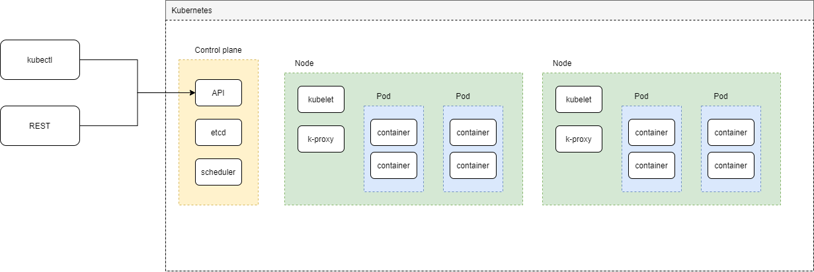

# Notes and Tutorials

Hi!

This repository contains a collection of notes and tutorials that are useful for learning basic software engeering concepts.

It's mostly a copy/paste of the official documentation, but often simplified. This helps me to find/remenber concepts easily.

## Codeforces

Problem solutions coded in golang. [Codeforces](https://codeforces.com/)

## Utils

Contains a csv parser and a json parser, as examples.

## Notes

### Links to the official documentation
- [Kubernetes](https://kubernetes.io/)

### Kubernetes simplified architecture

